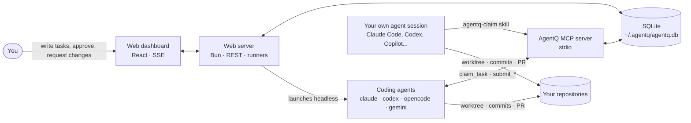
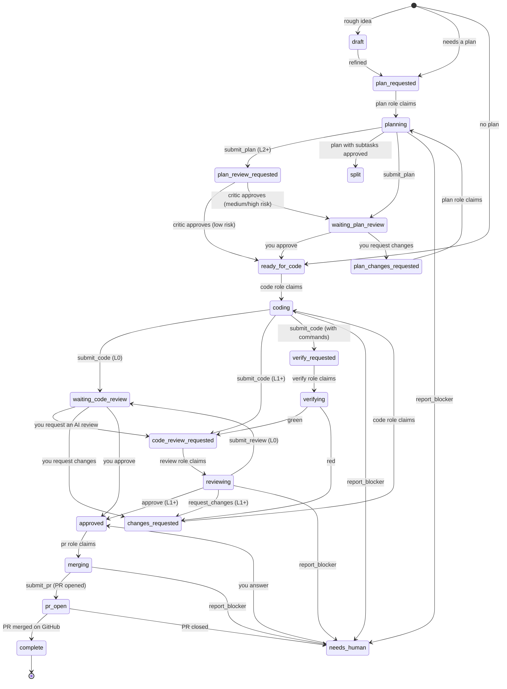

<div align="center">


# AgentQ

### If you want to be a 100x engineer, stop prompting and start queueing.

**A local-first task queue and Kanban board for AI coding agents.**
Write the task once. Claude Code, Codex, OpenCode, Gemini CLI or Copilot plan it, code it, review it and open the PR.
You approve at every gate.

[](https://github.com/sergiowero/agent-task-queue/actions/workflows/installer.yml)
[](LICENSE)
[](https://bun.sh)
[](https://www.typescriptlang.org/)
[](https://modelcontextprotocol.io)
[](#requirements)
[](#contributing)
[](https://github.com/sergiowero/agent-task-queue/stargazers)

[Quick start](#quick-start) · [How it works](#how-it-works) · [Workflow](#the-workflow) · [Runners](#runners-hands-free-mode) · [MCP tools](#mcp-tools) · [FAQ](#faq) · [Docs](#documentation)

</div>

<!-- TODO: add a screenshot or a short GIF of the board here, e.g. docs/assets/board.png -->

---

## Why AgentQ?

Coding agents are great at single tasks. Running **many** of them across **many** repositories is where things fall apart:

- Five terminals open, each with an agent doing *something*, and no single place to see what.
- Every session starts cold. The agent that reviews the code has no idea why the planner made the choices it made.
- Nobody is sure which agent touched which branch, or whether that "done" actually means merged.
- You end up babysitting prompts instead of reviewing outcomes.

AgentQ turns that chaos into a **queue**. You write well-scoped tasks on a board. Agents **claim** them, work in isolated git worktrees, and **submit** their output back with handoff notes for the next agent. You review plans and code in a single dashboard and approve, reject, or ask for another pass. The merge phase opens a pull request; it never touches your main branch by itself.

It all runs on your machine: one Bun process, one SQLite file, no accounts, no cloud.

## Features

|  |  |
|---|---|
| **Plan → Code → Review → Merge** | A 15-state workflow with human approval gates and feedback loops at every phase. |
| **Works with the agents you already use** | Claude Code, Codex, OpenCode, Gemini CLI, GitHub Copilot (CLI and VS Code), or any MCP client. |
| **One-command setup** | `bun run install:all` registers the MCP server and the workflow skills with every coding tool it finds, on macOS, Linux and Windows. |
| **Hands-free runners** | The server claims tasks and launches `claude`, `codex`, `opencode` or `gemini` headless in the right repo. No manual prompting. |
| **Composable roles** | One role per phase (refine, plan, plan_review, code, verify, review, pr); give an agent or runner any mix of them. Mix models per role. |
| **Context handoff** | Every submission carries notes for the next agent: decisions taken, gotchas, what to check next. No more cold starts. |
| **Isolated git worktrees** | One worktree and feature branch per task, so parallel agents never step on each other. |
| **Atomic claims** | Claims run in a SQLite transaction. Two agents never get the same task. |
| **Live Kanban dashboard** | React board with task details, conversation thread, status history, agents, runners with live logs, and an activity feed, all updated over SSE. |
| **Safe by default** | Runners use an allow-list of tools and commands. Merge means push + `gh pr create`, never a local merge or a force-push. |
| **Archive to Markdown** | Finished tasks are saved into the repo as a summary and a full record: plan, code notes, review, PR, agents and timeline. |
| **Local-first** | A single SQLite file at `~/.agentq/agentq.db`. Your code and your tasks stay on your machine. |

## How it works



1. **You** create a project (a local git repo) and write tasks with a description, guardrails and acceptance criteria.
2. **An agent claims** the highest-priority task one of its roles can work on, through the `claim_task` MCP tool.
3. **It does the phase's work** (plan, code, review or merge), guided by a phase skill, in the project directory or in the task's worktree.
4. **It submits** with a Markdown message plus handoff notes. The task moves to the next status and is released.
5. **You review** in the dashboard. Approve, request changes, or ask for an AI code review. The next agent picks it up.

Agents talk to AgentQ **only** through the MCP server, which writes straight to SQLite. The web server does not even need to be running for agents to work; the board catches up as soon as you open it.

## Quick start

### Requirements

- [Bun](https://bun.sh) 1.2 or newer
- Git
- [GitHub CLI](https://cli.github.com) (`gh`), authenticated, for the merge phase (it opens the pull request)
- At least one coding agent: [Claude Code](https://docs.anthropic.com/en/docs/claude-code), [Codex](https://github.com/openai/codex), [OpenCode](https://opencode.ai), [Gemini CLI](https://github.com/google-gemini/gemini-cli) or [GitHub Copilot](https://github.com/features/copilot)

### Install

```bash
git clone https://github.com/sergiowero/agent-task-queue.git
cd agent-task-queue
bun install
```

Connect your coding tools (MCP server + workflow skills). Safe to run again at any time:

```bash
bun run install:all
```

Start AgentQ:

```bash
bun run start
```

Open **http://localhost:3000**. The API and the dashboard share that single port.

### Your first task in two minutes

1. **Projects → New project.** Give it a name and the absolute path of a local git repository.
2. **Board → New task.** Describe what you want, add acceptance criteria, and choose whether it needs a plan first.
3. **Put an agent on it.** Pick one of the two modes:
   - **Hands-free:** open **Runners → New runner**, choose tool `claude` (or `codex`, `opencode`, `gemini`), keep the default roles (all but verify), mode `safe`, and start it. It claims the task within seconds.
   - **Interactive:** open your coding tool in any folder and say:
     > Work the AgentQ queue.

     The `agentq-claim` skill claims the task, routes to the right phase skill and keeps going until the queue is empty.
4. **Review.** The plan lands in *Needs you*. Approve it, and an agent writes the code in its own worktree. Approve the code, and an agent pushes the branch and opens a PR.
5. **Finish.** Confirm completion, then **Archive** to save the whole story as Markdown in the repo.

## Two ways to run agents

| Mode | What happens | Best for |
|---|---|---|
| **Runners** (hands-free) | The server polls the queue with its roles and launches the coding tool headless in the project directory, with the task and the phase skill as the prompt. Each job gets the MCP server automatically. | Background work, overnight queues, parallel agents |
| **MCP + skills** (interactive) | You open Claude Code, Codex, OpenCode, Gemini CLI or Copilot yourself and invoke the `agentq-claim` skill. You can watch and steer the session. | Pairing with an agent, trying new models, debugging tasks |

Both go through the same MCP server, the same SQLite database and the same workflow rules in `packages/shared`.

### Supported tools

| Tool | MCP server registered by `install:mcp` | Skills installed by `install:skills` | Runner |
|---|:---:|:---:|:---:|
| Claude Code | ✅ | ✅ | ✅ `claude` |
| Codex | ✅ | ✅ | ✅ `codex` |
| OpenCode | ✅ | ✅ | ✅ `opencode` |
| Gemini CLI | ✅ | | ✅ `gemini` |
| GitHub Copilot CLI | ✅ | | via `custom` |
| GitHub Copilot in VS Code | ✅ | | |
| Kimi Code, Junie | manual | ✅ | via `custom` |
| Any other MCP client | manual (`bun run mcp`) | | via `custom` |

## The workflow



Everything waiting for you is in the **Needs you** inbox (sidebar), oldest first: answers to blockers, plans to approve, code to review and PRs to merge. Any active task can also be **canceled**, and a stuck task can be **unblocked** from the task page. When an agent cannot finish (a rejected push, missing credentials, a contradictory task) it calls `report_blocker`: the task goes to **needs_human** with its question, and you answer from the task page and choose where it goes next. A runner job that ends three times in a row without submitting lands there too, instead of retrying forever.

### Autonomy

Each project has an autonomy level (L0–L3, default **L2**). From L1 up, `submit_code` goes straight to an AI review, and the reviewer's verdict routes the task: approve moves it toward the PR, request changes sends it back with findings tracked by id, and after three rounds (or a high-risk task, or a random spot check) a person decides. Nobody reviews their own code: a second runner (or agent session) that can review picks it up. L0 keeps every gate human. See [docs/policy.md](docs/policy.md).

The task ends on GitHub. The agent with the `pr` role opens the PR with a body AgentQ writes (criteria with their evidence, verification, the AI review, the risk) and the task waits in **pr_open**. With the `gh` CLI logged in, the server follows every open PR: merged completes the task (and archives it when the project asks), closed sends it to you. Without `gh`, click **Mark merged**. At **L3** with `autoMerge`, green low-risk PRs merge themselves. **Activity** shows how the flow is doing: human decisions per task, share of tasks that reached the PR without a person, review rounds, escalations.

Agents also have to show their work. Plans say how each acceptance criterion will be verified; coders submit evidence per criterion; and the server's built-in verifier runs the project's commands (set them under **Projects → Edit → Commands**) on every submission, catching red builds and weakened tests before any reviewer spends time on them. Each phase leaves a structured handoff for the next, and agents work from a compact brief instead of rereading the whole conversation, so round five costs about as many tokens as round one.

### Roles

A role is a phase. An agent or runner has **one or more** roles and claims the tasks of any of them; an agent that names none gets every role but `verify`.

| Role | Claims tasks in | Does |
|---|---|---|
| `refine` | `draft` | Turns a rough draft into a ready task: testable criteria, type, risk, scope |
| `plan` | `plan_requested`, `plan_changes_requested` | Reads the repo and writes the plan with its validation plan; splits big work into subtasks |
| `plan_review` | `plan_review_requested` | Critiques plans (L2+); a low-risk plan it approves goes straight to coding |
| `code` | `ready_for_code`, `changes_requested` | Codes in the task worktree with tests and evidence, and commits |
| `verify` | `verify_requested` | Runs the verification commands (the server has a built-in verifier) |
| `review` | `code_review_requested` | Reviews the commits; the verdict routes the task |
| `pr` | `approved` | Pushes the branch and opens the PR |

Compose them to fit your models: a cheap, fast model with `["code", "pr"]` and a stronger one with `["plan", "plan_review", "review"]`, or one agent with every role plus a second one with `["review"]`. Nobody reviews their own plan or code. Agents are identified as `<tool>@<version>|<model>`, so every plan, commit and review is traceable to the exact tool and model that produced it.

### The board

| Column | Statuses |
|---|---|
| **Pending** | `draft`, `plan_requested`, `plan_changes_requested`, `plan_review_requested`, `ready_for_code`, `changes_requested`, `verify_requested`, `code_review_requested`, `approved` |
| **In progress** | `refining`, `planning`, `plan_reviewing`, `coding`, `verifying`, `reviewing`, `merging`, `split` |
| **Needs you** | `waiting_plan_review`, `waiting_code_review`, `needs_human`, `pr_open` |
| **Done** | `complete` |

### Writing a good task

A task is the prompt. The more precise it is, the better the result:

- **Description**: what to build and why.
- **Steer details**: technical direction (libraries to use, files to touch, patterns to follow).
- **Guardrails**: hard constraints. They win any conflict (`Do not change the public API`, `No new dependencies`).
- **Acceptance criteria**: the checklist the reviewer verifies.
- **Priority, branch and merge branch**: which task goes first, where the work lives and where the PR targets.

Let an agent write tasks for you with the `agentq-create-task` skill: *"Create an AgentQ task to add rate limiting to the API."*

## Runners (hands-free mode)

A runner is a worker inside the web server with a **tool**, one or more **roles**, an optional **project**, a **model**, a **concurrency** and a **permission mode**. Every few seconds it claims the next eligible task and launches the tool headless in the project directory.

- **Model and effort pickers** are discovered from the installed CLIs (`claude --help`, `codex debug models`, `opencode models`...).
- **Live logs**: follow every job's output from the Runners page.
- **`safe` mode** (default): file edits, a fixed allow-list of commands (`git`, `gh`, `bun`, `npm`...) and only the MCP tools the phase needs.
- **`full` mode**: no permission prompts and no sandbox. Use only on repositories you trust the agent with unattended.
- **Crash recovery without heartbeats**: the runner is the parent process. If the tool exits without submitting, the task goes back to the queue with a system note containing the last 30 lines of output, and the runner backs off (30 s, doubling up to 30 min) before retrying it.
- **Bring your own agent**: the `custom` tool runs any argv you give it, with the prompt as the last argument and in `$AGENTQ_PROMPT`.

Everything is also available over REST (`/api/runners`). See [docs/runner.md](docs/runner.md) for the exact commands, environment variables and a scripted demo.

## MCP tools

The `agentq` MCP server exposes the whole agent protocol as typed tools. In Claude Code they appear as `mcp__agentq__<tool>`.

| Tool | Purpose |
|---|---|
| `claim_task` | Atomically claim the highest-priority task one of your roles works (`roles` is optional: all but `verify`) |
| `submit_plan` | Submit a plan and move the task to plan review |
| `submit_code` | Submit the worktree and move the task to code review |
| `submit_review` | Submit review findings with an approve or request-changes verdict |
| `submit_pr` | Record the pull request the `pr` role opened (`submit_merge` is its deprecated alias) |
| `get_task` | Read a task with its project, conversation and handoff notes |
| `post_comment` | Add a note to a task without changing its status |
| `list_projects`, `create_task` | Create well-formed tasks |
| `list_tasks`, `archive_task` | Find complete tasks and archive them to Markdown |

Every `submit_*` call requires a `context`: short handoff notes for the agent of the next phase. Resources `agentq://task/{taskId}` and `agentq://projects` are also available. Full inputs and outputs are in [docs/mcp.md](docs/mcp.md).

## Skills

Skills are the playbooks agents follow in each phase. `bun run install:skills` copies them into your tools' skill folders. Run it again (and restart your tools) after updating AgentQ: the server refuses skills older than the bundle it supports (6.0.0 replaced the single `role` with a `roles` list named after the phases).

| Skill | What it does |
|---|---|
| `agentq-claim` | Entry point. Claims a task and routes to the phase skill that matches its status, then loops until the queue is empty |
| `agentq-refine` | Turns a draft into a ready task: testable criteria, type, risk, scope |
| `agentq-plan` | Reads the repo read-only and writes or revises the plan |
| `agentq-plan-review` | Critiques a plan with a verdict and findings |
| `agentq-code` | Implements in `{project}/.agentq/worktrees/{taskId}` and commits after every round. Never pushes |
| `agentq-verify` | Runs the verification commands and reports evidence (the server also has a built-in verifier) |
| `agentq-review` | Reviews the commits read-only against acceptance criteria and guardrails |
| `agentq-pr` | Pushes the feature branch and opens a PR with `gh` and AgentQ's PR body. Never merges, never force-pushes |
| `agentq-create-task` | Turns a loose request into a well-structured task |
| `agentq-archive` | Archives complete tasks, finds the PR with `gh`, and writes an overview of what was done |

## Configuration

| Variable | Default | Purpose |
|---|---|---|
| `PORT` | `3000` | Port for the API and the dashboard |
| `AGENTQ_DB_PATH` | `~/.agentq/agentq.db` | SQLite database used by the server, the MCP server and every runner job |
| `AGENTQ_HOME` | `~/.agentq` | Where runner prompts, MCP configs and job logs are written (`runs/<taskId>/`) |
| `AGENTQ_JOB_TIMEOUT_MIN` | `60` | Kill a runner job that runs longer than this and release its task |
| `AGENTQ_PR_SYNC_SEC` | `180` | How often the server asks `gh` about open PRs (`AGENTQ_PR_SYNC=0` turns it off) |

Point the MCP server at another database with `bun run install:mcp --db <path>`.

## Architecture

```
agent-task-queue/
├── packages/
│   ├── shared/      # SQLite database, types, workflow rules: the single source of truth
│   ├── mcp/         # MCP server (stdio): the agent protocol as typed tools
│   ├── web/         # Bun HTTP server: REST API, SSE, static UI, runner engine
│   ├── web-ui/      # React dashboard
│   └── installer/   # install:mcp and install:skills for every supported tool
├── skills/          # agentq-claim, -plan, -code, -review, -merge, -create-task, -archive
├── design-system/   # Tokens, components and logos used by the dashboard
└── docs/            # Architecture, MCP, runners
```

**Stack:** Bun · TypeScript · SQLite (`bun:sqlite`) · Zod · MCP TypeScript SDK · React 19 · Vite · Tailwind CSS · TanStack Query · Server-Sent Events.

## Development

```bash
bun run dev          # server + Vite HMR on a single port
bun test             # all tests; they use in-memory or temp databases, never ~/.agentq/agentq.db
bun run typecheck    # every package
bun run lint         # ESLint
bun run format       # Prettier
bun run mcp          # the MCP server on stdio, as coding tools start it
```

The installer's end-to-end test runs the real `install:all` against a throwaway home folder on Linux, macOS and Windows in CI.

## FAQ

<details>
<summary><b>Does AgentQ send my code or tasks anywhere?</b></summary>

No. AgentQ is a local Bun process and a SQLite file. The only network traffic comes from the coding agents themselves (calls to their model provider) and from `git push` / `gh pr create` in the merge phase.
</details>

<details>
<summary><b>Do agents need the web server running?</b></summary>

No. The MCP server writes directly to the database. The dashboard picks up agent changes as soon as it is open. Runners do need the server, because they live inside it.
</details>

<details>
<summary><b>Can several agents work at the same time?</b></summary>

Yes. Claims are atomic, each task gets its own git worktree and feature branch, and every runner has a configurable concurrency.
</details>

<details>
<summary><b>What happens if an agent crashes halfway through?</b></summary>

With a runner, the task is released back to its previous status automatically, with the tail of the output attached as a note. In interactive mode, click **Unblock** on the task page. There are no heartbeats or leases by design: the process exiting is the signal.
</details>

<details>
<summary><b>Will an agent merge into my main branch?</b></summary>

No. The merge phase pushes the feature branch and opens a pull request into the task's merge branch. Merging the PR is up to you.
</details>

<details>
<summary><b>Can I use a model or tool that is not listed?</b></summary>

Yes. Any MCP client can use the `agentq` server (start it with `bun run mcp`), and the `custom` runner tool launches any command you want.
</details>

## Documentation

- [docs/mcp.md](docs/mcp.md): MCP server setup, every tool and its inputs
- [docs/runner.md](docs/runner.md): runners, commands per tool, permission modes, REST API, demo script
- [docs/architecture.md](docs/architecture.md): features, components, domain entities and task states
- [design-system/README.md](design-system/README.md): the dashboard's design system

## Contributing

Contributions are welcome, from typo fixes to new runner tools.

1. Fork the repository and create a branch from `main`.
2. Make your change, with tests when it touches behavior.
3. Run `bun test`, `bun run typecheck` and `bun run lint`.
4. Open a pull request describing what changed and why.

Found a bug or have an idea? [Open an issue](https://github.com/sergiowero/agent-task-queue/issues).

## Support the project

If AgentQ saves you from babysitting agents, **give it a star**. It helps other developers find it.

[](https://star-history.com/#sergiowero/agent-task-queue&Date)

## License

AgentQ is released under the [MIT License](LICENSE).
